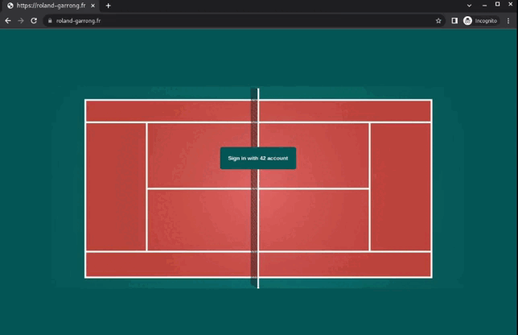

# ft_transcendence

## Deployed @ [roland-garrong.fr](https://roland-garrong.fr)

	

## Team
- [Pierre Cariou](https://github.com/pierrecariou)
- [Jehanne Dussert](https://github.com/JehanneDussert)
- [Alice Duchemin](https://github.com/aliceduchemin)
- [Alban Kerloch'](https://github.com/albankerloch)
- [Alexandre Lienard](https://github.com/lienardale)

## Project
- This is 42's comon-core final project
- The goal was to make a fullstack web platform with languages and technologies we never used before.
- Deployment was not part of the school's project, it was done as a way to gain understanding of various implications

## Stack

 
    
     
     
    
     
     

## Features
- Identification
  - Through 42's API system
  - Handling sessions
  - Handling refresh tokens
  - Securing routes & website access
- Chat
  - Through websockets
  - Private messages
  - Public channels
  - Private channels
  - Passwords
  - Channel admin (kick/ban/mute/invite)
- Admin Panel
  - See all users
  - Permanently ban/unban form the website
  - See all channels
  - Manage all channels
- User Pages
  - Change username / avatar
  - Friends / Askings / Blocked lists
  - Achievements
  - Game list
  - Search user
- Friend System
  - Through websockets
  - add / accept / deny / cancel / remove
  - block / unblock
- Pong Game
  - Through websockets
  - Classic Mode
  - Fast Mode
  - Matchmaking system
  - Watch ongoing games
  - Responsive

## Deployment

As said earlier, deployment was not part of the school's project, it was done as a way to gain understanding of various implications :

- working with a VPS :
  - configuring associated DNS
  - configuring Firewall
  - connecting SSH with VS Code
- adapt the code :
  - rewrite fetchs with dynamic paths ("localhost:3001" -> /api)
  - add https options for sockets ("ws://" -> "wss://" + "secure: true")
- configure an nginx reverse-proxy :
  - for the frontend
  - for the backend
  - for the sockets
  - for the server-side checks made by the front app
- implement ssl thanks to :
  - Letsencrypt
  - Certbot
- implement a minimalist CI/CD pipeline :
  - working with [Github's Docker Registry](https://docs.github.com/en/packages/working-with-a-github-packages-registry/working-with-the-docker-registry)
  - creating scripts to automate new-images push, pull, and redeployment
  - optimizing Docker images' size
    - working with intermediate containers
    - reducing cache size by minimysing the number of instructions
    - using light-weight (alpine) node images

## Run it locally

- To launch the website locally all in Docker :
  * create an application on 42's intranet (if you're not a student : too bad)
  * enter credentials in frontend/.env, frontend/.env.local & backend/.env
  * choose parameters for postgres in the same files  
  => docker-compose up --build -d

* To stop the website :  
  => docker-compose down

* To see the api documentation : localhost:3001/api

* To see the database : 
  - open with a navigator : localhost:8080 
  - connect with : admin@admin.com / admin
  - create a server (right click on Servers (top left) -> Create -> Serveur)
  - in the pop-up, enter the credentials you chose in the .env files in the second tab (host, username, pswd)
  - look at the tables in the Database > postgres > schemas > public > tables

## Run it on your own server

- Use the nginx.conf provided, modify it accordingly to instructions.
- Don't forget to open ports in the firewall.
- If you don't use a server_name, reverse proxies will not be of use, just connect to YOUR_SERVERS_IP:3000
- Don't build docker images in your production server. Use [Github's Container Registry](https://docs.github.com/en/packages/working-with-a-github-packages-registry/working-with-the-container-registry) or equivalent.

## Screenshots

